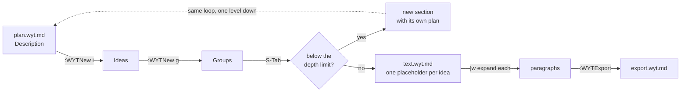

# WYT quick guide

One page for daily use: the WYT loop, its keys and commands, and the Neovim you
need to write with it. The rules behind each command are in the
[User Guide](../USER_GUIDE.md); install and API key setup are in the
[README](../README.md). A
[printable version](https://sirgrimorum.github.io/wyt/quick_guide.html) of this
page lives in `site/quick_guide.html`.

## The loop

1. `:WYTNew p` creates the project. Pick the language with care: switching it
   later hides the groups written in the old one.
2. Write the **Description** in `plan.wyt.md`, then add ideas with `:WYTNew i`
   or just type `- an idea` under `## Ideas`.
3. `:WYTNew g` gathers ideas into a `## Group:`. Order with `<S-Up>`/`<S-Down>`.
4. `<S-Tab>` on a group: it becomes a section with its own plan, or, at the
   type's depth limit, one placeholder per idea in `text.wyt.md`.
5. In `text.wyt.md`, `]w` jumps to the next placeholder and expands it: generate
   with the LLM or write it yourself.
6. `:WYTExport` assembles everything into `export.wyt.md` at the root.

Saving commits. You never touch git by hand, and every WYT jump saves first.

## WYT keys (normal mode, WYT files only)

| Key | In | Does |
|-----|----|------|
| `<S-Tab>` | plan | on a group or its ideas: implement it, or enter it if already done; on the `# ` title: back to the parent plan |
| `<S-Up>` / `<S-Down>` | plan | move the idea or group under the cursor |
| `]w` / `[w` | text | jump to the next / previous placeholder and expand it |
| `<leader>we` | text | expand the placeholder under the cursor |

`<leader>` is `\` unless your config changes it.

## WYT commands

| Command | Does |
|---------|------|
| `:WYTNew p` | new project |
| `:WYTNew i` | new idea, free or by the type's guided questions |
| `:WYTNew g` | new group; select idea lines with `V` first to pre-tick them |
| `:WYTNav` | pick any file or section of the project |
| `:WYTGoto plan\|text\|config\|export\|parent` | jump to that file |
| `:WYTSearch` | search characters, setting, chronology, concepts, sources |
| `:WYTGenerate [instruction]` | generate at the cursor: a bridge between paragraphs in text, new ideas in a plan |
| `:WYTExpand [next\|prev]` | same as `<leader>we`, `]w`, `[w` |
| `:WYTExport` | rebuild `export.wyt.md` |
| `:WYTConfig claude\|openai` | set the LLM provider and its key |
| `:checkhealth wyt` | check the install and where the key comes from |

In a picker (`:WYTNav`, `:WYTNew g`): type to filter, `<Tab>` ticks an item,
`<CR>` confirms, `<Esc>` cancels. In a prompt, `<Esc>` cancels and leaves things
as they were.

## Neovim for writers

**Modes.** You start in *normal* mode, where keys are commands. `i` enters
*insert* mode to type; `<Esc>` goes back. `:` opens the command line.

| Keys | Does |
|------|------|
| `:w` / `:q` / `:wq` / `:q!` | save / quit / save and quit / quit discarding changes |
| `i` `a` `o` `O` | insert before cursor / after cursor / on a new line below / above |
| `u` / `<C-r>` / `.` | undo / redo / repeat the last change |
| `w` `b` `e` | next word / previous word / end of word |
| `0` `$` / `gg` `G` | start / end of line; top / bottom of file |
| `{` `}` | previous / next paragraph |
| `gj` `gk` | down / up by screen line, for long wrapped paragraphs |
| `/text` then `n` `N` | search forward, next / previous match |
| `<C-o>` / `<C-i>` | jump back / forward to where you were |
| `V` then `j` `k` | select whole lines, for example ideas before `:WYTNew g` |
| `dd` / `yy` / `p` | cut / copy the line; paste below |
| `ciw` / `cis` / `cip` | change the word / sentence / paragraph under the cursor |
| `gqip` | reflow the paragraph to the text width |
| `gt` `gT` / `<C-w>w` | next / previous tab; next window |

**Writing comfort.** Worth setting for prose: `:set wrap linebreak` wraps long
paragraphs at word boundaries, and `:set spell spelllang=en` (or `es`) marks
typos. With spell on, `]s` / `[s` jump between mistakes and `z=` suggests fixes.

**Stuck?** `<Esc>` a few times gets you back to normal mode. `:help <topic>`
explains anything, for example `:help ciw`.
